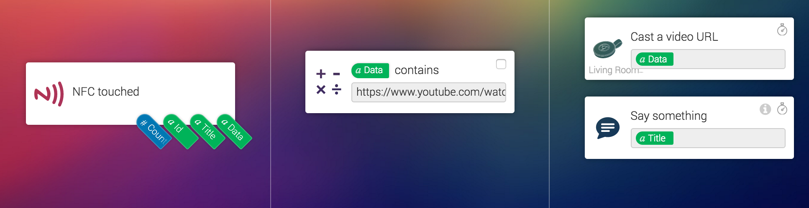
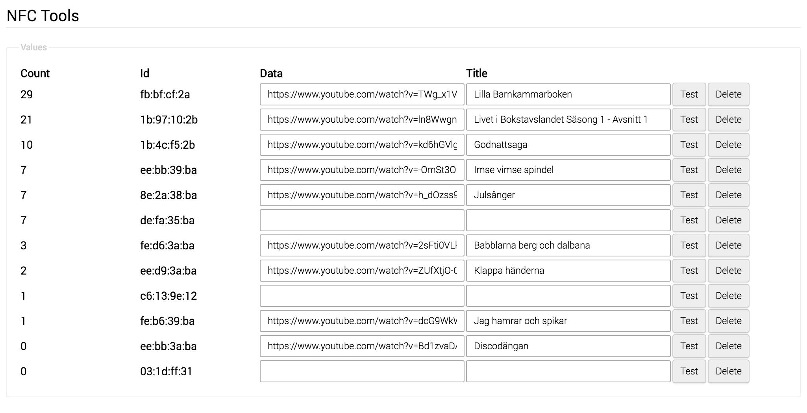

# NFC Tools

With this app you can register NFC cards in settings and add additional values to each card that can be used in flows as tags. It also have a counter so that you know how many times a card has been used.

If you like this app, then consider to buy me a toy for my kids :)

## Changelog:

V1.0.0
* Initial Release
